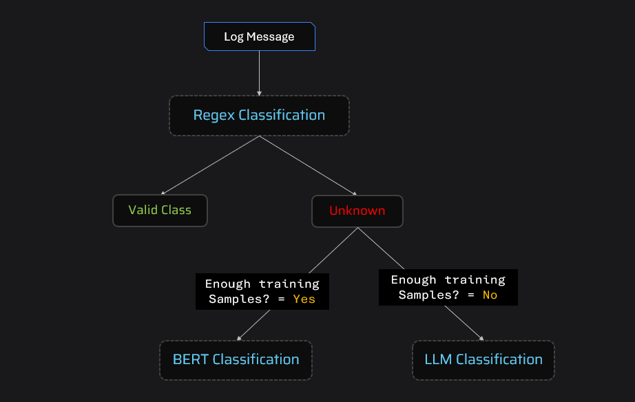

# Log Classification System

## Overview
The **Log Classification System** is designed to classify log messages into meaningful categories using a combination of **regular expressions (Regex), BERT-based encoding, and Large Language Models (LLM)**. The system is optimized for scalability, handling structured and unstructured logs efficiently.

## Features
- **Pattern-based classification** using Regex for predefined log structures.
- **Clustering with DBSCAN** to identify log patterns.
- **BERT-based classification** for complex logs without predefined patterns.
- **LLM-based classification** for logs with insufficient training samples.
- **Multi-source log handling** (e.g., ModernCRM, BillingSystem, LegacyCRM, etc.).

## Technologies Used
- Python
- Pandas
- Sentence Transformers (SBERT)
- DBSCAN Clustering
- Regular Expressions
- Logistic Regression
- LangChain & Groq LLM

## Installation
Ensure you have Python installed and then install the required dependencies:

```bash
pip install pandas sentence-transformers scikit-learn langchain_groq
```

## Usage
1. **Load log data** from a CSV file.
2. **Apply clustering and regex-based classification** to structured logs.
3. **Use BERT-based classification** for complex logs.
4. **Utilize LLM-based classification** when training data is insufficient.
5. **Run the classification pipeline** on your logs.

<h1 align="center">
    <br>
    
    <br>
</h1>

### Example Execution
To classify logs from a CSV file:

```python
def classify_csv(input_file):
    df = pd.read_csv(input_file)
    df["target_label"] = classify(list(zip(df["source"], df["log_message"])))
    df.to_csv("output.csv", index=False)
    return "output.csv"
```

## Contributions
Feel free to contribute by submitting issues, improving regex patterns, or optimizing classification methods.

